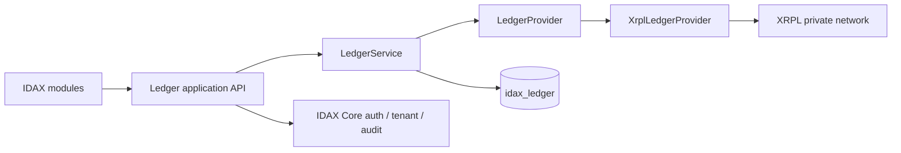
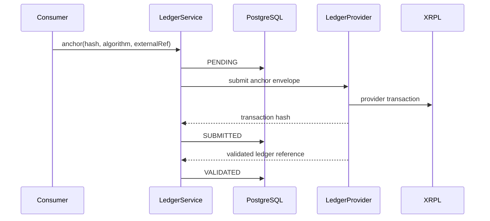

# Architecture

## Límites

`LedgerProofService` expresa los casos de uso Proof/Anchor; `LedgerProvider` es el puerto estable;
`XrplLedgerProvider` es el primer adaptador. Los DTO públicos no contienen
tipos XRPL. Bitcoin/Litecoin no se implementan, pero pueden añadir adaptadores
sin cambiar consumidores.

## Repositorios

- `backend`: dominio genérico, API de alto nivel, persistencia y provider SPI.
- `frontend`: extensión del shell IDAX; nunca una SPA paralela.
- `xrpl`: red, configuración, bootstrap de identidad y scripts operativos.
- `main`: composición del entorno; referencia artefactos de los demás repos.
- `doc`: decisiones y runbooks.

## Anchor / proof propuesto

La entrada es SHA-256 precalculado con perfil explícito o payload JSON I-JSON
canonicalizado con RFC 8785 JCS. PostgreSQL conserva el
registro completo de operación y tenant. XRPL recibe sólo una referencia opaca,
algoritmo/perfil y digest; nunca documento, PII ni secretos.

Estados definidos: `PENDING`, `SIGNED`, `SUBMITTED`, `VALIDATED`,
`FAILED_RETRYABLE` y `FAILED_PERMANENT`. La API usa idempotency key por tenant y
una unicidad semántica por `tenant + externalId + proofType + digest`. La
verificación separa integridad del contenido y existencia/validación del anchor.

El diseño definitivo de Fase 5A, incluida canonicalización JCS, modelo de datos,
idempotencia, estados y wire format v1, está en `PROOF_ANCHOR_DESIGN.md`.

## Datos y multitenancy

Networks, nodes y validators continúan siendo configuración, no tablas.
`ledger_proof` y `ledger_submission` son tenant-scoped y están protegidas por
RLS PostgreSQL (`app.tenant_id`, `idax_admin`, `idax_app`). Una red física sirve
a múltiples tenants; no se crea una cadena por tenant.

## API incremental

Primero: `GET /api/ledger/networks`, `/{id}`, `/{id}/status`, ledgers y
transacciones de sólo lectura. Después: `POST /api/ledger/proofs`, consulta y
verificación. Los endpoints usan seguridad, errores y permisos de IDAX Core y
no exponen JSON-RPC genérico.

### Phase 4 implemented surface

- `GET /api/ledger/networks`
- `GET /api/ledger/networks/{networkId}`
- `GET /api/ledger/networks/{networkId}/status`
- `GET /api/ledger/networks/{networkId}/nodes`
- `GET /api/ledger/networks/{networkId}/ledgers/{ledgerIndex}`
- `GET /api/ledger/networks/{networkId}/transactions/{hash}`

Todos requieren `LEDGER_READ`. Testnet y Mainnet se publican como configuración
desactivada; sólo `private-xrpl` está habilitada por defecto. La elección de
`networkId` en la ruta evita resultados ambiguos cuando existan varios ledgers.
La autenticación reutiliza los JWT de IDAX Core (`TokenValidator`, `CurrentUser`
y `TenantContext`) y la autorización reutiliza `PermissionService`; Ledger no
expone login ni mantiene usuarios, roles o tenants paralelos.

## Observabilidad

Actuator ofrece health/info/metrics. Un health contributor XRPL será sano sólo
si responde, su ledger validado progresa, la edad está bajo umbral y los
validadores esperados proponen. Docker aplica la misma comprobación semántica.
CPU/RAM/disco se obtienen del runtime existente; no se instala otra plataforma.

Disponibilidad actual y retención son señales distintas. El health ordinario
queda `DOWN/DEGRADED` si un nodo devuelve `complete_ledgers=empty`, pero no exige
que el rango activo contenga todo el historial. La retención se valida mediante
la prueba dedicada que consulta por índice y compara el hash histórico.

## Licencia pendiente

- Apache-2.0: explícita sobre patentes y adecuada para infraestructura
  empresarial; propuesta preferida.
- MIT: muy simple y permisiva, con protección de patentes menos explícita.
- AGPLv3: asegura publicación de modificaciones servidas por red, pero complica
  adopción e integración empresarial.

`xrpld` usa ISC, compatible con las tres opciones. No se incorpora su código al
repositorio. La decisión final requiere inventario SBOM de dependencias y
aprobación del propietario; no se añade todavía `LICENSE`.
